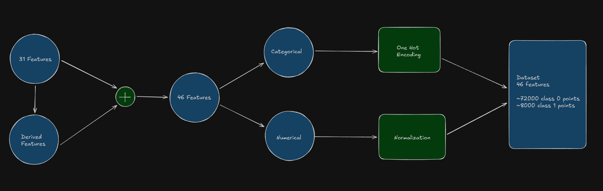

# Synthetic Default Prediction using GAN + Ensemble Learning

This project explores the generation of realistic synthetic financial data using a Generative Adversarial Network (GAN), followed by predictive modeling using an ensemble of machine learning classifiers. The primary motivation is to overcome the constraints of limited or imbalanced credit datasets while maintaining realistic patterns found in real borrower profiles.

---

## 🎯 Objective

Predict the probability of loan default using a combination of:
- **Synthetic data generated via GAN**
- **Multiple tuned machine learning models**
- **Soft voting ensemble for final prediction**

With this approach, the model benefits from both:
- A richer dataset during training, and  
- Reduced model variance using ensemble learning.

---

## 🧠 Why Synthetic Data with GAN?

Financial datasets face several challenges:
- Limited access due to privacy regulations
- Class imbalance (few default cases)
- Missing or noisy borrower information

A GAN (Generative Adversarial Network) mimics real data distribution by using two networks:
- **Generator** tries to produce fake but realistic samples
- **Discriminator** learns to distinguish real from synthetic

Through adversarial training, the generator eventually produces high-quality synthetic samples resembling the real dataset. These samples help the classifier generalize on harder examples and avoid overfitting.

---

## ⚙️ Model Pipeline

1. **Data Preparation**
   - Clean and preprocess real financial data
   - Handle missing values, scaling, encoding
   - Split train/test sets

2. **GAN Training**
   - Train the GAN on real data features
   - Generate synthetic samples
   - Combine real + synthetic data for training

3. **Model Training**
   - Train individual models:
     - LGBoost
     - XGBoost
     - CatBoost
   - Use **hyperparameter tuning (Optuna)** to find optimal configurations

4. **Soft Voting Ensemble**
   - Combine predictions from all tuned models
   - Soft voting averages predicted probabilities
   - Helps reduce bias from any single model

---

## 🧩 Architecture Diagram

Below is a simplified representation of the model flow:




The diagram shows how synthetic data enters multiple base learners whose decisions are averaged to generate the final default prediction.

---

## 📦 Installation & Setup

### 1. Clone the repository
```
git clone https://github.com/VivekChoudhary1502/finGAN.git
cd finGAN
```

### 2. Install dependencies
``` 
pip install -r requirements.txt
```

### 3. Run the notebook
```
jupyter main.ipynb
```

## 🏋️ Training the Model

The notebook contains two main phases:

### A. Train the GAN
- Generates synthetic samples
- Saves the generated dataset into `/data/`

### B. Train the Ensemble Model
- Loads both real and synthetic datasets
- Performs Optuna hyperparameter tuning
- Trains the final voting ensemble

---

## 📊 Evaluation Metrics

The model is evaluated using the following metrics:

- **ROC-AUC curve**

These metrics assess how well the model distinguishes defaulters from non-defaulters, especially on imbalanced data.

---

## 🧪 Results Summary

- **ROC-AUC:** `0.679`

---

## 🔮 Future Work

Potential enhancements to this research include:

- Use **Conditional GANs** for feature-controlled generation
- Incorporate **SHAP** values for explainability
- Deploy a **scalable API** for real-time default prediction
- Try **Weighted Voting** to improve minority class prediction

---

## 📚 References

- Ian Goodfellow et al., **Generative Adversarial Networks**
- **XGBoost**: Scalable Tree Boosting System
- **Optuna**: Automatic Hyperparameter Optimization Framework

---

## 👤 Author

Developed by **Vivek Choudhary** as part of a project on synthetic data generation and financial default prediction.
